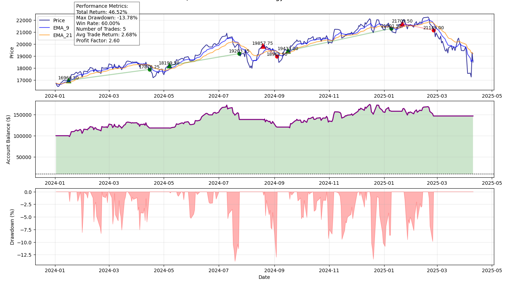

# EMA Trading Signal Project



This project implements an EMA crossover trading strategy for NQ futures (Nasdaq-100 futures) using Python. It generates trading signals, calculates equity curves, and visualizes performance with price, trade signals, equity curve, and drawdown plots. Outputs can be used in Power BI for further analysis.

## Table of Contents
- [Overview](#overview)
- [Features](#features)
- [Requirements](#requirements)
- [Installation](#installation)
- [Data Preparation](#data-preparation)
- [Usage](#usage)
- [File Structure](#file-structure)
- [Documentation](#documentation)

## Overview
The script `scripts/EMA_Trading_Signal.py` analyzes NQ futures data to generate trading signals based on 9-period and 21-period EMA crossovers. It computes trade outcomes, equity curves, drawdowns, and performance metrics. Users can use the provided `data/nq=F_trading_data.csv` or download new stock data via `yfinance`.

## Features
- Generates buy/sell signals using EMA crossovers.
- Calculates trade profit/loss, returns, and equity curves.
- Plots price, EMAs, trade entries/exits, equity curve, and drawdown.
- Provides metrics: total return, max drawdown, win rate, profit factor.
- Supports downloading new stock data with `yfinance`.
- Integrates with Power BI for visualization.

## Requirements
- Python 3.8+
- Packages: `os`, `pandas`, `numpy`, `matplotlib`, `yfinance`
- Visual Studio (optional, for `EMA_Trading_Signal.sln`)
- Power BI Desktop (optional, for visualization)
- Git (for cloning)

## Installation
1. Clone the repository:
   ```bash
   git clone https://github.com/leoncc24/EMA-Trading-Signal.git
   cd EMA-Trading-Signal
   ```

2. Create a virtual environment (recommended):
   ```bash
   python -m venv venv
   source venv/bin/activate  # Windows: venv\Scripts\activate
   ```

3. Install packages:
   ```bash
   pip install pandas numpy matplotlib yfinance
   ```

4. (Optional) Open `EMA_Trading_Signal.sln` in Visual Studio to manage scripts.

## Data Preparation
The project uses `data/nq=F_trading_data.csv` by default. Alternatively, users can download new stock data using `yfinance`.


###  Download Data with yfinance
To use a different stock or date range:
1. Open `scripts/EMA_Trading_Signal.py` in a text editor or Visual Studio.
2. Uncomment the `yfinance` code block:
   ```python
   ticker = 'NQ=F'  # NQ futures symbol
   start_date = '2024-01-01'
   end_date = '2025-04-11'
   data = yf.download(ticker, start=start_date, end=end_date)
   data.columns = data.columns.droplevel(1)  # Fix multi-index

   # Calculate indicators
   data["EMA_9"] = data["Close"].ewm(span=9, adjust=False).mean()
   data["EMA_21"] = data["Close"].ewm(span=21, adjust=False).mean()
   data['Signal'] = 0
   data['Signal'][9:] = (data['EMA_9'][9:] > data['EMA_21'][9:]).astype(int)
   data['Position'] = data['Signal'].diff()

   print(f"Saving data to {csv_path}...")
   data.to_csv(csv_path, index=False)
   ```
3. Modify:
   - `ticker`: E.g., `AAPL` (Apple), `SPY` (S&P 500 ETF).
   - `start_date`, `end_date`: Use `YYYY-MM-DD` format.
   - `csv_path`: Ensure it points to `data/<filename>.csv`.
4. Comment out the default CSV code to avoid conflicts:
   ```python
   # csv_path = os.path.abspath(os.path.join(script_dir, '..', 'data', 'nq=F_trading_data.csv'))
   # df = pd.read_csv(csv_path)
   # data = pd.DataFrame(df)
   ```
5. Run the script to save the new CSV:
   ```bash
   python scripts/EMA_Trading_Signal.py
   ```
6. Verify the new CSV in `data/` has `Date`, `Close`, `EMA_9`, `EMA_21`, `Position`.

## Usage
1. Ensure `data/nq=F_trading_data.csv` or a custom CSV is in `data/`.
2. Run the script:
   ```bash
   python scripts/EMA_Trading_Signal.py
   ```
   Or in Visual Studio:
   - Open `EMA_Trading_Signal.sln`.
   - Set `EMA_Trading_Signal.py` as startup file (right-click > Set as Startup File).
   - Run (F5).
3. The script:
   - Loads data (CSV or `yfinance`).
   - Calculates trades, equity curve, and drawdown.
   - Displays performance metrics and plots.


## File Structure
```
EMA-Trading-Signal/
├── EMA_Trading_Signal.sln        # Visual Studio solution
├── data/
│   └── nq=F_trading_data.csv     # NQ futures data
├── scripts/
│   └── EMA_Trading_Signal.py     # EMA strategy script
└── gitignore
```
