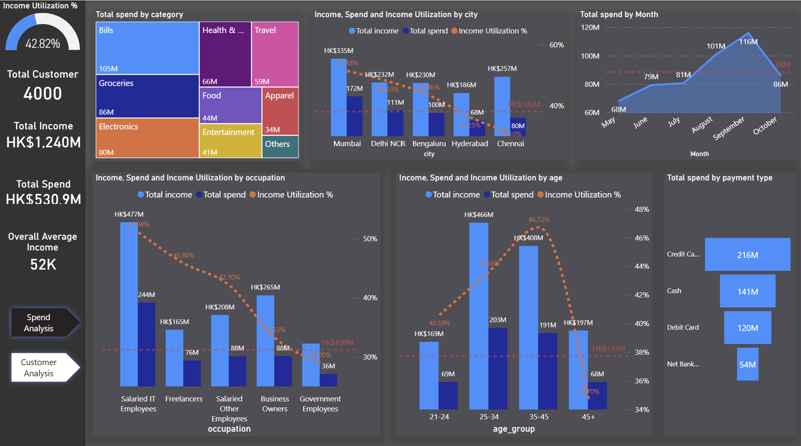
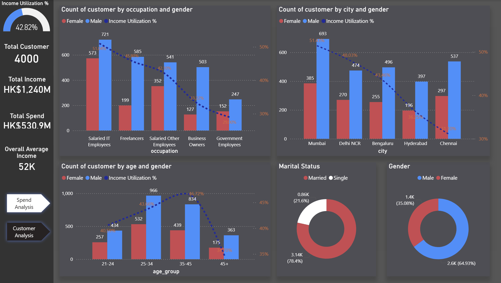

# Dashboard of Customer Income and Expense

##  Project Overview
Power BI dashboard analyzing **6 months of 4000 customers income and expense practice** across 5 cities, tracking key characteristics including:
- Spend category
- Occupation
- Age
- City
- Payment type
- Monthly Trends

** 
Get insight of Where do people spend money the most? Does it have any impact due to occupation, gender, city, age etc.
Identify and profile key customer segments that are likely to be the highest-value users of the new credit cards.  
**

##  Setup Instructions

### Prerequisites
- Power BI Desktop 

### Installation
1. Clone this repository
2. Open `PowerBI_Credit_Card.pbix`
3. Update data source path to your local copy:
   - `Transform Data` → `Data Source Settings`
4. Refresh data (`Home` → `Refresh`)

##  Key Metrics Calculated

| Metric | Formula | Description |
|--------|---------|-------------|
| **Total income** | `VAR avg_income = SUM(dim_customers[avg_income])
return avg_income * 6 ` | Amount of income |
| **Total spend** | `DIVIDE([Total spend],[Total income])  ` | Amount of spends |
| **Income Utilization % ** | `DIVIDE([Total spend],[Total income]) ` | What percentage of income do they spend  |

##  Data Coverage
- **Period**: May - October 
- **Properties**: 4000 customers across 5 cities
- **Update Frequency**: monthly manual uploads

##  Sample Analysis Views
1. **Key matrix cards**
   - Total Income
   - Total Spend
   - Average Income
   - Overall income utilization%    

2. **Treemap of spend category**
   - 9 main spending practices

3. **Bar charts of income, expese and utilization% by different features**
   - City
   - Occupation
   - Age

4. **Monthly spend pattern**
   -Total spend across 6 months
   

##  Documentation
- (docs/meta_data.txt) - Data Dictionary Field definitions and sources
- (docs/metrics list.xlsx) - Metric Formulas Detailed KPI calculations
- (docs/power_query_doc.txt) - Data Loading and Power Query Documentation

