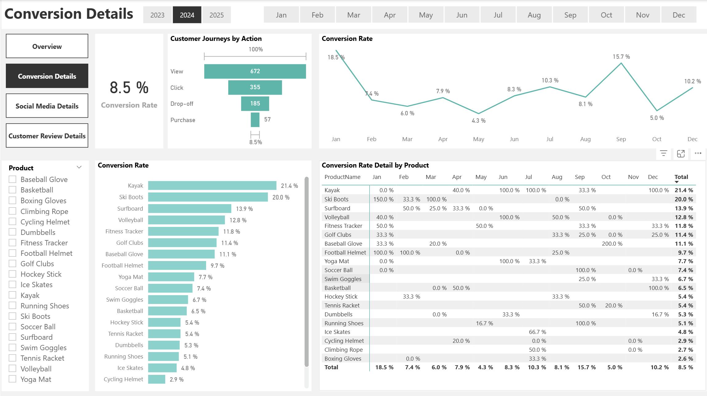

# Digital Marketing Performance Dashboard

## Project Overview
Power BI dashboard analyzing **3 years of E-Commerce Digital Marketing performance** , tracking key digital marketing metrics including:
- Conversion Rate
- Number of Views
- Number of Clicks
- Number of Likes
- Rating
- Review Sentiments

##  Setup Instructions

### Prerequisites
- Power BI Desktop 

### Installation
1. Clone this repository
2. Open `PowerBI_Digital_Marketing_Performance.pbix`

##  Key Metrics Calculated

| Metric | Formula | Description |
|--------|---------|-------------|
| **Number of Customer Reviews** | `DISTINCTCOUNT( fact_customer_reviews_with_sentiment[ReviewID] ) ` ||
| **Rating (Average)** | `AVERAGE( fact_customer_reviews_with_sentiment[Rating] ) ` ||
| **Views** | `SUM ( fact_engagement[Views] )` | Utilization rate |
| **Number of Campaigns** | `DISTINCTCOUNT( fact_engagement[CampaignID] ) ` ||
| **Conversion Rate %** | `(VAR TotalVisitors = CALCULATE( COUNT (fact_customer_journey[JourneyID]) , fact_customer_journey[Action] = "View" )VAR TotalPurchases = CALCULATE(COUNT(fact_customer_journey[JourneyID]),fact_customer_journey[Action] = "Purchase")RETURN IF(TotalVisitors = 0, 0, DIVIDE(TotalPurchases, TotalVisitors)) )` ||

##  Data Coverage
- **Period**: Jan 2023 - Dec 2025
- **Properties**: 3 Content Types
- **Update Frequency**: Daily

##  Sample Analysis Views
1. **Key matrix cards**
   - Conversion Rate
   - Number of Views
   - Number of Clicks
   - Number of Likes
   - Average rating

2. **Bra Charts of Performance by product**
   - Conversion Rate
   - Average Rating
   - Views by content type

3. **Trend by key matrix**
   - Monthly performance patterns
   

