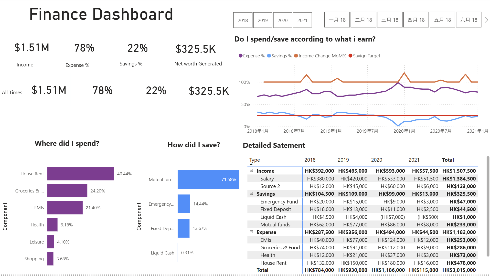

# Personal Finance Dashboard

##  Project Overview
Power BI dashboard analyzing **years of personal finance status** , tracking income, expense and savings including:
- Total income
- Expense %
- Savings %
- Net worth generated

##  Setup Instructions

### Prerequisites
- Power BI Desktop 

### Installation
1. Clone this repository
2. Open `PowerBI_Finance_Dashboard.pbix`
3. Update data source path to your local copy:
   - `Transform Data` → `Data Source Settings`
4. Refresh data (`Home` → `Refresh`)

##  Key Metrics Calculated

| Metric | Formula | Description |
|--------|---------|-------------|
| **Income** | `calculate(sum(FinData[Value]),FinData[Type]="Income")  ` | Total income over time |
| **Expense%** | `DIVIDE([Total Expense],[Total Income])  ` | Percentage of expense over income |
| **Savings** | `DIVIDE([Total Saving],[Total Income]) ` | Percentage of savings over income |
| **Net worth generated** | `CALCULATE(sum(FinData[Value]),FinData[Type]="Savings")  ` | Total savings |

##  Data Coverage
- **Period**: 2018 - 2021
- **Properties**: 3 main types of transaction: income, expense and savings. 2 sub-type of income, 4 sub-types of savings and 6 sub-types of expense
- **Update Frequency**: monthly manual uploads

##  Sample Analysis Views
1. **Key matrix cards**
   - Total income
   - Expense %
   - Savings %
   - Net worth generated

2. **Table of transcation summary b**
   - All 3 types and their sub-types summary
     
3. **Trend by key matrix**
   - month over month finance patterns

4. **Expense and Savings charts
   - clearly showing the percentage of each component of expense and savings
   

##  Documentation
- (docs/meta_data_Finance.txt) - Data Dictionary Field definitions and sources
- (docs/metrics list.xlsx) - Metric Formulas Detailed KPI calculations
- (docs/power_query_doc.txt) - Data Loading and Power Query Documentation

