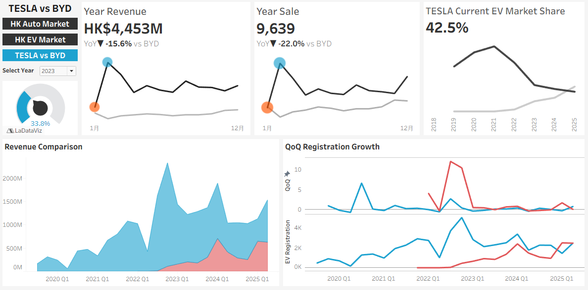
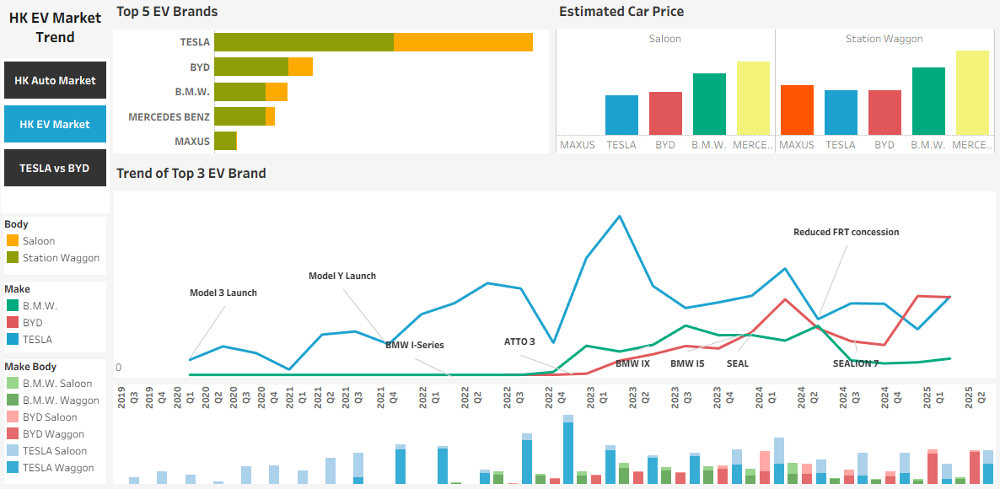
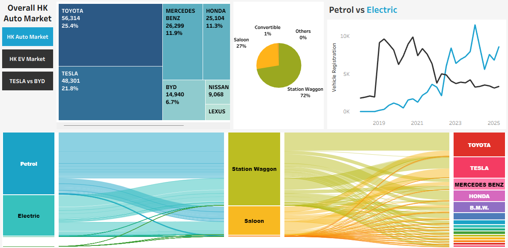

# Hong Kong Auto Market - Tesla and BYD Comparison Dashboard

##  Project Overview
-Summarize and visualize Hong Kong Private Car Registration data, identify the distribution and trend of the market

-Dive deep into Tesla and BYD, comparing, both revenue, sale and market share

### Prerequisites
- Tableau Public

##  Key Metrics Calculated

| Metric | Formula | Description |
|--------|---------|-------------|
| **Car Sale Revenue** | `[Avg Price]*[Registrations]  ` | Estimated car price multiply to registration number |
| **CY Tesla Sales** | `IF YEAR([Year-Month]) = [Select Year]AND [Make]= 'Tesla' THEN [Car Sale Revenue]
END  ` | Revenue of each month when used with Year-Months columns and year parameter selection |
| **Savings** | `IF YEAR([Year-Month]) = [Select Year]-1 AND [Make]= 'Tesla' THEN [Car Sale Revenue]
END  ` | Revenue of the previous year |
| **QoQ registration** | `(SUM([Registrations]) - LOOKUP(SUM([Registrations]), -1)) / ABS(LOOKUP(SUM([Registrations]), -1))  ` | Quarter over Quarter growth of registration number |

##  Data Coverage
- **Period**: 2018 - 2025
- **Properties**: From HK Transport Department, Newly registered private car data: fuel, body, make
- **Update Frequency**: monthly uploads

##  Sample Analysis Views
1. **HK Overall Auto Market**
   - Market share by brands
   - Car body distribution
   - Petrol vs Electric Trend

2. **HK EV Market Breakdown**
   - Top 5 EV Brands
   - Their estimated car price by body
   - Trend of registration of the Top 3 EV brands
     
3. **Compare Tesla with BYD by key matrix**
   - Year Revenue
   - Year Sale
   - Market Share
   - QoQ Registration Growth

   

