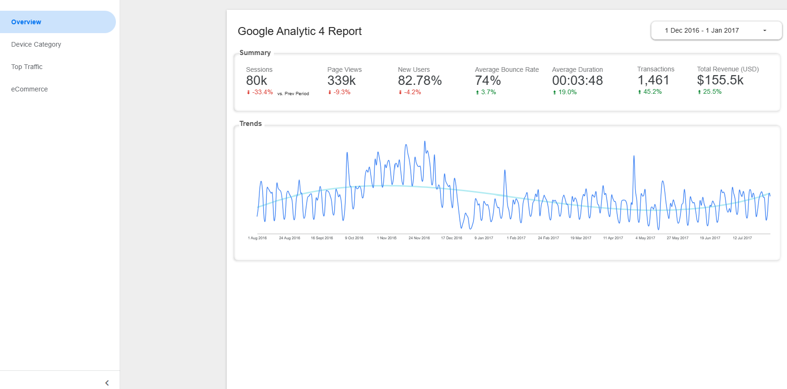
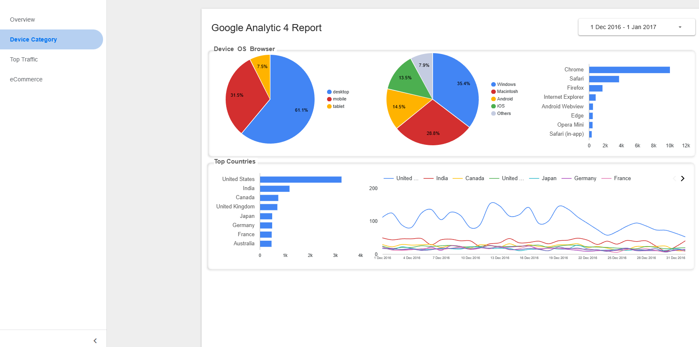
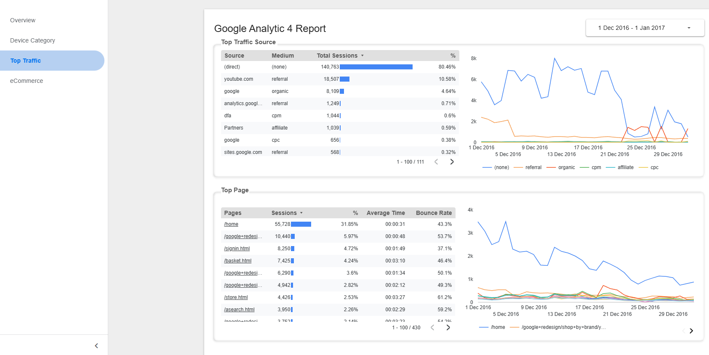
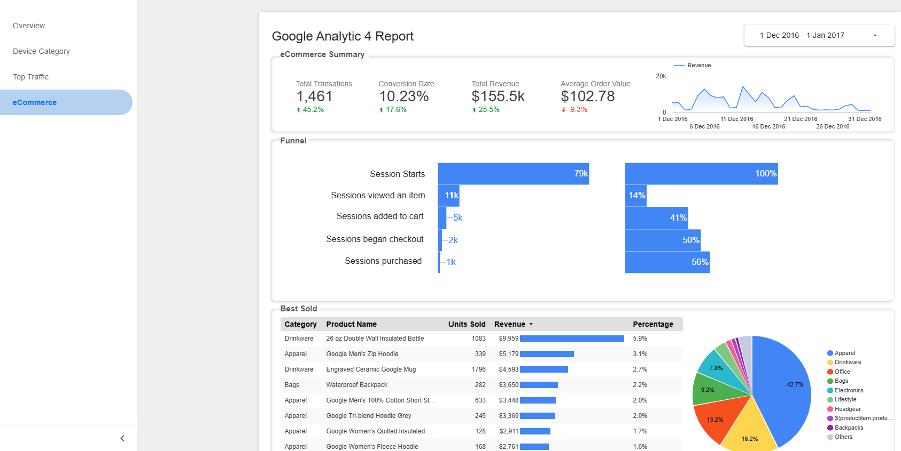

# Google Analytic 4 Looker Studio Dashboard

**[🔗 Open Interactive Dashboard →](https://lookerstudio.google.com/reporting/52bfe5bd-1898-467f-acda-79ec566d6f2b)**

*Public link – no login required | Auto-updates daily from BigQuery*

## Project Overview

This project simulates the **daily workflow** used by SEO agencies when managing Google Analytics 4 (GA4) for clients
However due to confidentiality, this project is using realistic data public in the BigQuert market instead of a real website GA4 data

1. **GA4 Implementation** (skipped)
   GA4 property is added to the client website via Google Tag Manager
   
2. **Daily BigQuery Export** (skipped)
   GA4’s built-in daily export automatically appends raw event data into a BigQuery table (`ga_sessions_*` partitioned by date)
   
3. **Scheduled Queries & Views**  
   Every morning, BigQuery **scheduled queries** run to:
   - Clean and aggregate raw data
   - Create production-ready views (daily metrics, channel performance, landing page analysis, etc.)

4. **Looker Studio Dashboard**  
   Looker Studio connects **live** to the BigQuery views → dashboard automatically refreshes with the latest data
   
## File Structure
```
GA4 Dashboard/
├── README.md
├── sql/
│   ├── vw_daily_performance.sql
│   ├── vw_user_demographics.sql
│   ├── vw_popular_pages.sql
│   └── vw_funnel.sql
│   └── vw_popular_sku.sql
└── doc/
    ├── screenshot1.png
    ├── screenshot2.png
    ├── screenshot3.png
    └── screenshot4.png
    
```


### Prerequisites
- Text Editor for viewing sql files
- Browser (recommend Chrome) for opening the looker studio dashboard


##  Calculated Field Added

| Metric | Formula | Description |
|--------|---------|-------------|
| **Average Order Value** | ` total_revenue_usd/transactions ` | Average revenue across the period |
| **View Rate** | ` sessions_viewed_item/total_sessions ` | % of view after session started |
| **Cart Rate** | ` sessions_added_to_cart/sessions_viewed_item ` | % of adding item to cart |
| **Checkout Rate** | ` sessions_checkout/sessions_added_to_cart ` | % of checkout |
| **Purchase Rate** | ` sessions_purchased/sessions_checkout ` | % of purchased item  |

##  Data Coverage
- **Period**: 1 Aug 2018 - 1 Aug 2017
- **Update Frequency**: daily uploads via GA4 native connector with looker studio
- **Partition**: daily table created with naming ga_sessions_* (date wildcard)

##  Sample Analysis Views
1. **Key matrix cards**

    - Sessions
    - Page Views
    - New Users
    - Bounce Rate
    - Average Duration
    - Transactions
    - Revenue

2. **User Demographic Analysis**

   - Pie chart: Device and OS
   - Bar chart: Browser and Countries

3. **Source and Medium Analysis**

   - Table break down: sessions and sessions% of source and medium
   - Table break down: sessions, average time on page and bounce rate of each page

3. **eCommerce Analysis**

   - Key Metrics: Total Transaction, conversion rate, total revenue, average order value
   - Line chart: revenue daily trend
   - Funnel chart: % of each session (start, view item, add item to cart, checkout, purchase)
   - Table break down: goods and product revenue
   


