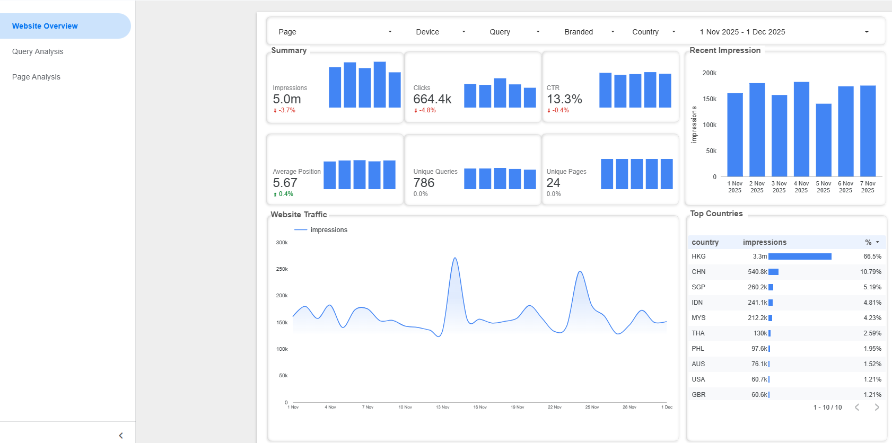
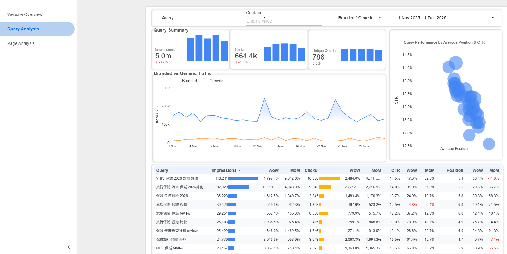
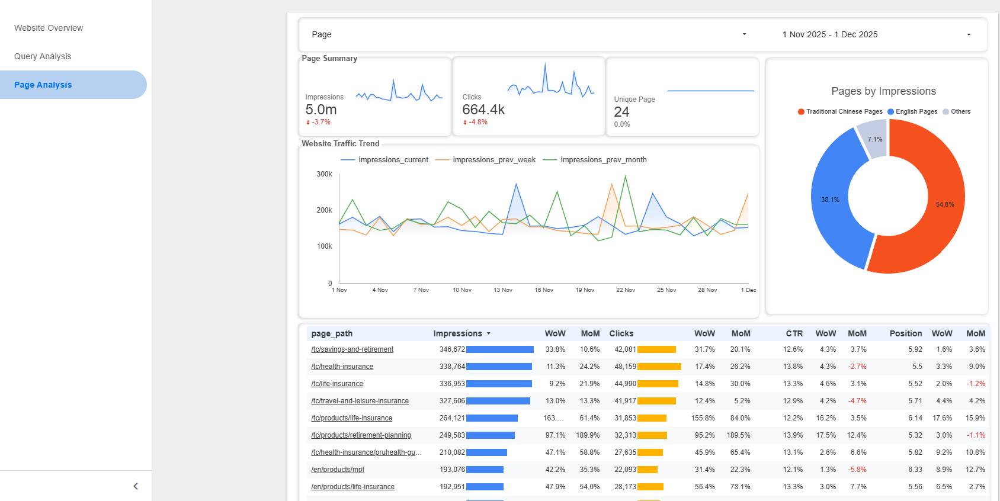

# Google Search Console Looker Studio Dashboard

**[🔗 Open Interactive Dashboard →](https://lookerstudio.google.com/reporting/5aedc640-a8ee-4dc7-a0e9-4a0adf303c2f)**

*Public link – no login required | Auto-updates daily from BigQuery*

## Project Overview

This project simulates the **daily workflow** used by SEO agencies when managing Google search console for clients
However due to confidentiality, this project is using synthetic and realistic data generated with Python Code instead of a real website GSC data

1. **GSC Implementation** (skipped)
   GSC daily performance report is bulk exported to BigQuery
   
2. **Daily BigQuery Export** (skipped)
   Data is loaded into the table(`searchdata_url_impression`) inside the specific project dataset in BigQuery (append new days)
   
3. **Scheduled Queries & Views**  
   Everyday, BigQuery **scheduled queries** run to:
   - Clean and aggregate raw data
   - Create production-ready views (daily metrics, query performance, page analysis)

4. **Looker Studio Dashboard**  
   Looker Studio connects **live** to the BigQuery views → dashboard automatically refreshes with the latest data
   
## File Structure
```
GSC Dashboard/
├── README.md
├── sql/
│   ├── vw_seo_performance.sql
│   ├── vw_query_trends.sql
│   └── vw_page_trends.sql
└── doc/
    ├── screenshot1.png
    ├── screenshot2.png
    └── screenshot3.png
    
```


### Prerequisites
- Text Editor for viewing sql files
- Browser (recommend Chrome) for opening the looker studio dashboard


##  Calculated Field Added

| Metric | Formula | Description |
|--------|---------|-------------|
| **chi_eng** | ` CASE WHEN REGEXP_CONTAINS(page_path, '(?i)/tc/') THEN 'Traditional Chinese Pages' WHEN REGEXP_CONTAINS(page_path, '(?i)/en/') THEN 'English Pages' ELSE 'Others' END ` | Chinese or English page |


##  Data Coverage
- **Period**: 1 Aug 2025 - 27 Jan 2026
- **Update Frequency**: daily uploads via GSC native connector with looker studio
- **Partition**: daily appends the new day's rows into the same table (searchdata_url_impression) which is date-partitioned 

##  Sample Analysis Views
1. **Key matrix summary**

    Matrix Cards:
    - Impressions
    - Clicks
    - Click Through Rate(CTR)
    - Average Position
    - Unique Queries
    - Unique Pages
    
    Line chart: Website traffic trends
    
    Table: distribution of user countries

2. **Query Analysis**

   - Line chart: comparison between branded and generic traffic
   - bubble chart: relationship between average position and CTR
   - Table break down: key matrix changes(impressions, clicks, CTR, position) of each query 

3. **Page Analysis**

   - Line chart: comparison among current, previous week, previous month website traffic
   - Pie chart: website impression(traffic) by languages
   - Table break down: key matrix changes(impressions, clicks, CTR, position) of each page


## Insights
- Spot user demographic peference and website optimization direction -  majority of users are from HK and visit the chinese version of the pages
  
- Products related to life insurance, travel insurance and VHIS need to be focused - high search and CTR for related keywords
  
- Early and seasonal promotion of products in the last quarter to outcomplete the competitiors - Higher impression and spike showed at the last quarter


